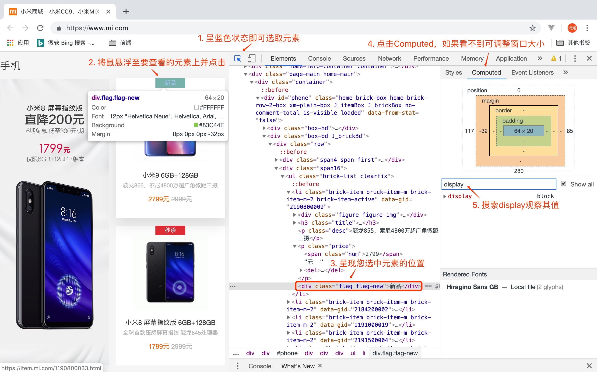

# 一、前言

一个基本的网站包含多个网页，一个网页由 HTML, CSS 和 JavaScript  组成，其中：

- HTML：结构层，决定网页的结构和内容（ *是什么❓* ）
- CSS：渲染层，设定网页的表现样式（ *长啥样❓* ）
- Javascript：行为层，控制网页的行为（ *做什么❓* ）

**开发工具：**

工欲善其事必先利其器，推荐使用 VSCode IDE，[点击前往官网下载 >>](https://code.visualstudio.com/download)

# 二、HTML是什么？

HTML（**H**yper**T**ext **M**arkup **L**anguage，超文本标记语言） 是一种描述语言，用来定义网页结构。

# 三、发展历史

1990 年，由于对 [Web](https://developer.mozilla.org/zh-CN/docs/Glossary/World_Wide_Web) 未来发展的远见，Tim Berners-Lee 提出了 [超文本](https://developer.mozilla.org/zh-CN/docs/Glossary/Hypertext) 的概念，并在第二年在 [SGML (en-US)](https://developer.mozilla.org/en-US/docs/Glossary/SGML) 的基础上将其正式定义为一个标记语言。[IETF (en-US)](https://developer.mozilla.org/en-US/docs/Glossary/IETF) 于 1993 年正式开始制定 HTML 规范，并在经历了几个版本的草案后于 1995 年发布了 HTML 2.0 版本。1994年，Berners-Lee 为了 Web 发展而成立了 [W3C (en-US)](https://developer.mozilla.org/en-US/docs/Glossary/W3C)。1996 年，W3C 接管了 HTML 的标准化工作，并在1年后发布了 HTML 3.2 推荐标准。1999 年，HTML 4.0 发布，并在 2000 年成为 [ISO (en-US)](https://developer.mozilla.org/en-US/docs/Glossary/ISO) 标准。

自那以后，W3C 几乎放弃了 HTML 而转向 [XHTML](https://developer.mozilla.org/zh-CN/docs/Glossary/XHTML)，并于 2004 年成立了另一个独立的小组 [WHATWG](https://developer.mozilla.org/zh-CN/docs/Glossary/WHATWG)。幸运的是，WHATWG 后来又转回来参与了 [HTML5](https://developer.mozilla.org/zh-CN/docs/Glossary/HTML5) 标准的制定，两个组织（译注：即 W3C 和 WHATWG）在 2008 年发布了第一份草案，并在 2014 年发布了 HTML5 标准的最终版。

> 提示：摘自[MDN >>](https://developer.mozilla.org/zh-CN/docs/Glossary/HTML)

# 四、概念和语法

HTML 文档是包含多个 HTML 元素 的文本文档。每个元素都用一对开始和结束标签包裹，每个标签以尖括号（`<>`）开始和结束，如：

```html
<div>Hello</div>
```

其中 `<div>` 为开始标签，`</div>` 为结束标签， `Hello` 为文本内容。当然，也有一部分标签中不需要包含文本，这些标签称为 **空标签**，如 ``。


你也可以使用 **属性** 来扩展 HTML 标签，属性用来提供一些附加信息，这些信息可能会影响浏览器对元素的解析。属性在开始标签中设置，其形式为 `key=value`，多个属性之间使用空格隔开。


# 五、元素分类

HTML 元素类型主要分为块级元素（`block`）、行内元素（`inline`）以及行内块元素（`inline-block`），三种元素类型的特性如下：

- 块级元素：单独占一行，具备盒子模型（即可设置宽度和高度）；
- 行内元素：不独占一行，不具备盒子模型（即不可设置宽度和高度，大小由内容决定）；
- 行内块元素：不独占一行，不具备盒子模型（即不可设置宽度和高度，大小由内容决定）；

> 提示：对于块级元素而言，即使你设置了宽高，其也会独占一行。

**如何判断一个元素的类型？**

在谷歌浏览器中鼠标右键检查元素，然后通过元素选取器选取要查看元素类型的元素，最后在computed中搜索display属性观察其值即可。如下所示：



# 六、标签嵌套

所谓标签的嵌套，是指一个标签对以内包含另外一个标签，如：`<html>` 标签内包含 `<head>` 和 `<body>` 两个标签对，而 `<head>` 标签内又可以包含 `<meta>` 和`<title>` 等标签。也就是说标签不仅可以单独存在，又可以包含其它一个或多个标签，而且标签的嵌套可以是多层的，并且嵌套层数是没有限制的。

标签的嵌套根据代码规范性、性能和SEO（搜索引擎优化）等方面考虑，应当遵循以下规则：

- HTML页面中所有 **需要显示在浏览器窗口内的内容** 均需要放置在 `<body>` 标签对以内。
- 在不影响页面显示、CSS样式设置和DOM操作的前提下，标签的 **嵌套层数是越少越好**。
- 标签嵌套的基本顺序应该是：**块级标签>行内块标签>行内标签**。
- 同一个显示类型的标签可以相互嵌套，如：“**块级标签>块级标签**”、“**行内块标签>行内块标签**”和“**行内标签>行内标签**”。
- 避免使用“行内标签”去嵌套“行内块标签”和“块级标签”、“行内块标签”去嵌套“块级标签”，虽然有的时候在显示上并不会出现问题，但“行内标签”大部分是不具备布局属性的，需要进行显示类型转换（*display*）才能够进行CSS的布局设置，既麻烦，又不规范。

# 七、HTML 基本文档结构

HTML基本文档结构是指组成一个基本的HTML页面所必须的元素标签。具体编写格式如下：

```html
<!-- 指定文档类型-->
<!DOCTYPE html>
<!-- 根标签 -->
<html lang="zh-CN">
<!-- 头部标签 -->
<head>
  <!-- 指定字符编码 -->
  <meta charset="UTF-8">
  <!-- IE浏览器兼容性处理 -->
  <meta http-equiv="X-UA-Compatible" content="IE=edge">
  <!-- 视窗 -->
  <meta name="viewport" content="width=device-width, initial-scale=1.0">
  <!-- 网页标题 -->
  <title>Document</title>
</head>
<!-- 内容标签 -->
<body>网页内容</body>
</html>
```


