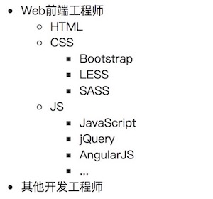

# 一、文本标签 

- [\<span>](<https://developer.mozilla.org/zh-CN/docs/Web/HTML/Element/span>)：文本标签，一般用于描述一段文字信息或短文本
- [\<p>](<https://developer.mozilla.org/zh-CN/docs/Web/HTML/Element/p>)：段落标签，一般用于描述文章、新闻、博客中的一个段落或长文本
- [\<h1~h6>](<https://developer.mozilla.org/zh-CN/docs/Web/HTML/Element/Heading_Elements>)：标题标签

# 二、布局 & 语义化标签 

- [\<div>](<https://developer.mozilla.org/zh-CN/docs/Web/HTML/Element/div>)：通用布局容器标签。

- [\<article>](<https://developer.mozilla.org/zh-CN/docs/Web/HTML/Element/article>)：用于文章、新闻或博客的容器标签。*(H5)*

- [\<section>](<https://developer.mozilla.org/zh-CN/docs/Web/HTML/Element/section>)：章节标签。*(H5)*

- [\<aside>](<https://developer.mozilla.org/zh-CN/docs/Web/HTML/Element/aside>)：指定附注栏，包括引述、侧栏、指向文章的一组链接、广告、友情链接、相关产品列表等。*(H5)*

- [\<header>](<https://developer.mozilla.org/zh-CN/docs/Web/HTML/Element/header>)：页眉，通常包括网站标志，主导航，全站链接及搜索框。*(H5)*
- [\<footer>](<https://developer.mozilla.org/zh-CN/docs/Web/HTML/Element/footer>)：页脚，通常包括网站版权信息、友情链接等。*(H5)*

- [\<nav>](<https://developer.mozilla.org/zh-CN/docs/Web/HTML/Element/nav>)：标记导航，仅对文档中重要的链接使用。HTML5规范不推荐对辅助性页脚使用nav，除非页脚再次显示顶级全局导航，或者包含招聘信息等重要链接。*(H5)*

- [\<main>](<https://developer.mozilla.org/zh-CN/docs/Web/HTML/Element/main>)：页面主要内容，一个页面只能使用一次。如果是web应用，则包围其主要功能。*(H5)*

# 三、实用标签 *

## 1、图片：[\< img >](<https://developer.mozilla.org/zh-CN/docs/Web/HTML/Element/img>)

\ 标签主要用于显示图片，其主要常用属性如下：

- src：设置图片链接地址
- width/height：设置图片宽度/高度
- title：设置图片标题，鼠标悬浮在图片上时显示
- alt：设置提示，当图片加载失败时会显示

## 2、超链接：[\< a >](<https://developer.mozilla.org/zh-CN/docs/Web/HTML/Element/a>)

\<a> 标签主要用于超链接，HTML 使用超链接与网络上的另一个文档相连。几乎可以在所有的网页中找到链接。点击链接可以从一张页面跳转到另一张页面。其主要常用属性如下：

- href：链接地址，可以是本地链接地址，也可以是在线链接地址
- target：定义被链接的文档在何处显，其值包括：\_blank、\_*self*、\_parent、_top

### 2.1. 代码示例

```html
<!-- 在线跳转 -->
<a href="https://www.baidu.com">跳转至百度</a>
<!-- 本地跳转 -->
<a href="./pages/details.html">跳转至详情</a>
```

### 2.2. 锚点跳转

利用超链接可以跳转到本页锚点，类似于书签跳转，将a标签的“href”属性设置为“#”+“指定元素的ID值”后，该超链接不再是进行页面间的跳转或是文件的打开了，而是将页面滚动到本页面中ID属性值和“href”属性值“#”后的值所对应的值的地方，页面滚动的目标元素的上边缘将和浏览器内容窗口上边缘重合。

```html
<div id="anchor"></div>
<a href="#anchor">点击跳转到锚点</a>
```

### 2.3. 下载

加上 `download` 属性指示浏览器下载 URL 而不是导航到它，因此将提示用户将其保存为本地文件。

```html
<a href="https://images.baidu.com/lihy.jpg"  download="lihy">点击下载图片</a>
```

### 2.4. 占位

在项目开发中，如果你布局了一个超链接，但是超链接所连接的页面还没有开发出来，那你可以使用 “#” 号或“javascript:void(0)”替代 href 属性值。

### 2.5. 回到顶部

利用超链接也可以实现回到顶部的需求，即指定 *href* 属性值为 *#top*，但是这样设置时直接跳至顶部，给用户一种突兀的感觉，后期可通过 JavaScript + css 实现回到顶部的效果。

## 3、列表

html 包括无序列表、有序列表及定义列表，其显示类型为块级元素。

### 3.1. 无序列表 [\< ul>](<https://developer.mozilla.org/zh-CN/docs/Web/HTML/Element/ul>)

常用属性：

- type：列表项目符号类型
  - disc：实心圆（默认）
  - circle：空心圆
  - square：小方块

使用示例：

```html
<ul type="disc">
    <li>无序列表01</li>
    <li>无序列表02</li>
    <li>无序列表03</li>
</ul>
```

### 3.2. 有序列表 [\< ol >](<https://developer.mozilla.org/zh-CN/docs/Web/HTML/Element/ol>)

常用属性：

- type：列表项目符号类型（1（默认）/A/a/I/i）
- reversed：倒序
- start：起始值（对阿拉伯数字有效）

 使用示例：

```html
<ol type="a" reversed start="6">
    <li>有序列表01</li>
    <li>有序列表02</li>
    <li>有序列表03</li>
</ol>
```

### 3.3. 定义列表 [\< dl >](<https://developer.mozilla.org/zh-CN/docs/Web/HTML/Element/dl>)

定义列表分为两层：第一层为定义的列表dl；第二层分为两个部分，即dt和dd，dt用于定义列表中的项目，dd用于描述定义的项目，它们的显示类型都为“块级元素（block）”。相对于“无序列表”和“有序列表”，这种列表由于其自身的结构原因，对需要进行名词性描述的列表更为适用。

```html
<dl>
    <dt>苹果</dt>
    <dd>苹果（学名：Malus pumila）是水果的一种，是蔷薇科苹果亚科苹果属植物，其树为落叶乔木。苹果的果实富含矿物质和维生素，是人们经常食用的水果之一。</dd>

    <dt>草莓</dt>
    <dd>草莓（学名：Fragaria × ananassa Duch.），多年生草本，高10-40厘米。茎低于叶或近相等，密被开.展黄色柔毛。叶三出，小叶具短柄，质地较厚，倒卵形或菱形，上面深绿色，几无毛，下面淡白绿色，疏生毛，沿脉较密；叶柄密被开展黄色柔毛。聚伞花序，花序下面具一短柄的小叶；花两性；萼片卵形，比副萼片稍长；花瓣白色，近圆形或倒卵椭圆形。聚合果大，宿存萼片直立，紧贴于果实；瘦果尖卵形，光滑。花期4-5月，果期6-7月。</dd>

    <dt>樱桃</dt>
    <dd>樱桃（学名：Cerasus pseudocerasus），是某些李属类植物的统称，包括樱桃亚属、酸樱桃亚属、桂樱亚属等。乔木，高2-6米，树皮灰白色。小枝灰褐色，嫩枝绿色，无毛或被疏柔毛。冬芽卵形，无毛。</dd>
</dl>
```

### 3.4. 列表嵌套

无序列表与有序列表嵌套使用方式一致，这里以无序列表为例:

```html
<ul>
    <li>Web前端工程师
        <ul>
            <li>HTML</li>
            <li>CSS
                <ul>
                    <li>Bootstrap</li>
                    <li>LESS</li>
                    <li>SASS</li>
                </ul>
            </li>
            <li>JS
                <ul>
                    <li>JavaScript</li>
                    <li>jQuery</li>
                    <li>AngularJS</li>
                    <li>...</li>
                </ul>
            </li>
        </ul>
    </li>
    <li>其他开发工程师</li>
</ul>
```

  示例效果：




## 4、表格：[\< table >](<https://developer.mozilla.org/zh-CN/docs/Web/HTML/Element/table>)

\<table> 标签主要用于定义表格

### a、相关概念

- thead：表头（表格标题及头部信息不等）
- tbody：表中（表格显示的内容部分）
- tfoot  ：表尾（表格说明与备注部分）
- tr：行
- th：单元格，作为行或列的标题呈现
- td：单元格，作为内容单元格呈现
- caption：表格主标题，位于表格之外

### b、相关属性

- width/height：设置宽度/高度
- border：设置边框
- align：设置表格对齐方式（left/center/right）
- cellspacing：设置单元格与单元格之间的间距
- cellpadding：设置单元格与内容之间的间距
- bgcolor：设置表格背景颜色
- background：设置背景图片
- colspan：合并列 ‘*\<td colspan="2">\</td>*’
- rowspan：合并行 ‘*\<td rowspan="2">\</td>*’

# 四、转义符

- `&nbsp`：空格
- `&gt;`：大于
- `&lt;`：小于
- `&copy;`： 版权号
- `&amp;`：&符号


