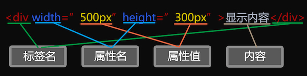

# # 什么是HTML？

HTML（Hyper Text Markup Language） ，即超文本标记语言。HTML不是编程语言，因此其与其他编程语言（如：Java、C及Objective-c等）是有区别的。标记语言由一系列标签组成，通过标记标签来描述网页。

# # HTML标签

HTML 标记标签通常被称为 HTML 标签 (HTML tag)。

- HTML 标签是由尖括号包围的关键词，如：`<html>`
- HTML 标签通常是成对出现的，如：`<span> </span>`
- 标签对中的第一个标签（`<span>`）被称为开始标签，第二个标签（`</span>`）被称为结束标签
- 开始和结束标签也被称为开放标签和闭合标签

> 提示：在HTML中标签名是不区分大小写的，也就是说一个标签既可以全部写成大写的英文字母，也可以全部写成小写的英文字母（主流的写法），如：“\<head>”写成“\<HEAD>”，“\<body>”写成“\<BODY>”都不会影响页面的正常运行。甚至还可以将一个标签元素的英文字母大小混写都是不影响页面正常运行的，但这种做法会影响代码的可读性，并不推荐。

# # HTML文档与网页

- HTML 文档描述网页
- 文档包含HTML标签和纯文本
- HTML 文档也被称为网页

Web 浏览器的作用是读取 HTML 文档，并以网页的形式显示出它们。浏览器不会显示 HTML 标签，而是使用标签来解释页面的内容。

# # 属性

HTML 标签可以拥有属性，属性提供了有关HTML标签的更多属性，属性以键（`key`）值（`value`）对的形式出现，即：`key = "value"`，如：`title = 'HTMLTest'`，属性一般定义在开始标签中。

```html
<a href="https://github.com/LiHongyao" target="_blank">点击前往</a>
```

上述代码定义了一个 **a** 标签（超链接），该标签拥有 `href` 及 `target` 属性，提供了链接地址以及在什么窗口下打开新的页面，标签中的文本为呈现在页面上的内容。

# # 元素

HTML 元素指的是从开始标签（start tag）到结束标签（end tag）的所有代码，即元素由开始标签、结束标签、属性以及内容组成。




# # 元素分类

html 元素分为 块级元素（block）、行内元素（inline）以及行内块元素（inline-block）。

- 块级元素：独占一行，具备盒子模型，即可设置大小；
- 行内元素：不独占一行，不具备盒子模型，大小由内容决定；
- 行内块元素：不独占一行，具备盒子模型；

> 提示：对于块级元素而言，即使你设置了宽高，其也会独占一行。

# # 标签嵌套

所谓标签的嵌套，是指一个标签对以内包含另外一个标签，如：\<html>标签内包含\<head>和\<body>两个标签对，而\<head>标签内又可以包含\<meta>和\<title>等标签。也就是说标签不仅可以单独存在，又可以包含其它一个或多个标签，而且标签的嵌套可以是多层的，并且嵌套层数是没有限制的。

标签的嵌套根据代码规范性、性能和SEO（搜索引擎优化）等方面考虑，应当遵循以下规则：

- HTML页面中所有需要显示在浏览器窗口内的内容均需要放置在\<body>标签对以内。
- 在不影响页面显示、CSS样式设置和DOM操作的前提下，标签的嵌套层数是越少越好。
- 标签嵌套的基本顺序应该是：“*块级标签*>*行内块标签*>*行内标签*”。
- 同一个显示类型的标签可以进行嵌套，如：“块级标签>块级标签”（\<p>除外）、“行内块标签>行内块标签”和“行内标签>行内标签”。
- 避免使用“行内标签”去嵌套“行内块标签”和“块级标签”、“行内块标签”去嵌套“块级标签”，虽然有的时候在显示上并不会出现问题，但“行内标签”大部分是不具备布局属性的，需要进行显示类型转换（*display*）才能够进行CSS的布局设置，既麻烦，又不规范。

# # 文档流

所谓文档流就是HTML文档中可显示元素在排列时所占用的位置。HTML文档流中的标签元素遵循“从左到右、从上到下”的排列次序，有如现代汉字的书写顺序一样，但又存在着一些差别。

#  # 文档结构

HTML（Hyper Text Markup Language 超文本标记语言）基本文档结构是指组成一个基本的HTML页面所必须的元素标签。它的根节点是由一个文档声明 “`<!doctype html>`” 和一个“`<html>`”标签组成的，而`<html>`标签下级（又称“子节点”）又包含“`<head>`”和“`<body>`”两个主要的标签，具体编写格式如下：

```html
<!DOCTYPE html>
<html lang="zh-Hans">
    <head>
        <meta charset="UTF-8">
        <title>Document</title>
    </head>
    <body></body>
</html>
```

结构解读：

- <!DOCTYPE html>：定义文档的类型为HTML。
- \<html>：根标签。
- \<head>：头部标签，放置网页基本信息，如标题、编码格式、JavaScript文件引入及层叠样式表引用等。
- \<meta>：无结束标签，通过对应的属性来设置编码格式（必要）、设备显示缩放、搜索引擎关键字、描述、浏览器内核渲染方式等内容。
- \<title>：设置网页标题。
- \<body>：内容标签，网页显示的所有内容，HTML中所有的文本、基本标签、表单标签、\<canvas>标签、超链接、图像、音频、视频等有实质内容的标签都赢放置于\<body>内，否则浏览器内核将不能正确的渲染并最终显示。


