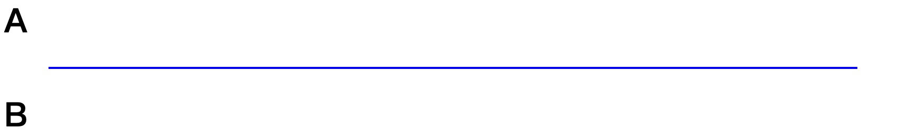
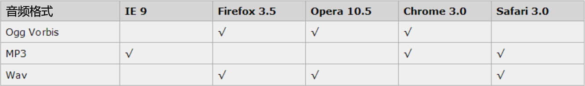
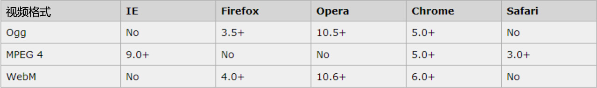
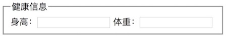
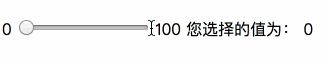

# 一、文本格式化标签

- 粗体：[\<b>](<https://developer.mozilla.org/zh-CN/docs/Web/HTML/Element/b>)
- 斜体：[\<i>](<https://developer.mozilla.org/zh-CN/docs/Web/HTML/Element/i>)
- 强调：[\<strong>](<https://developer.mozilla.org/zh-CN/docs/Web/HTML/Element/strong>)
- 上标：[\<sup>](<https://developer.mozilla.org/zh-CN/docs/Web/HTML/Element/sup>)
- 下标：[\<sub>](<https://developer.mozilla.org/zh-CN/docs/Web/HTML/Element/sub>)
- 小号字：[\<small>](<https://developer.mozilla.org/zh-CN/docs/Web/HTML/Element/small>)
- 插入字：[\<ins>](<https://developer.mozilla.org/zh-CN/docs/Web/HTML/Element/ins>)
- 删除字：[\<del>](<https://developer.mozilla.org/zh-CN/docs/Web/HTML/Element/del>)
- 着重字：[\<em>](<https://developer.mozilla.org/zh-CN/docs/Web/HTML/Element/em>)

> 提示：文本格式化标签只需要了解即可，后期可通过 CSS 实现文本格式化标签所呈现的效果。

# 二、引用标签

- [\<address>](<https://developer.mozilla.org/zh-CN/docs/Web/HTML/Element/address>)：一般用于真实地址、URL、电子邮箱、电话号码、社交媒体账号、地理坐标等等
- [\<q>](<https://developer.mozilla.org/zh-CN/docs/Web/HTML/Element/q>)：短引用
- [\<blockquote>](<https://developer.mozilla.org/zh-CN/docs/Web/HTML/Element/blockquote>)：长引用
- [\<cite>](<https://developer.mozilla.org/zh-CN/docs/Web/HTML/Element/cite>)：该标签通常表示它所包含的文本对某个参考文献的引用，比如书籍或者杂志的标题。

# 三、布局 & 语义化标签

- [\<iframe>](<http://www.w3school.com.cn/tags/tag_iframe.asp>)：iframe 元素会创建包含另外一个文档的内联框架（即行内框架）。
- [\<figure>](<https://developer.mozilla.org/zh-CN/docs/Web/HTML/Element/figure>)：创建图（默认有40px左右margin）。
- [\<figcaption>](<https://developer.mozilla.org/zh-CN/docs/Web/HTML/Element/figcaption>)：figure的标题，必须是figure内嵌的第一个或者最后一个元素。

# 四、实用标签

## 1、[\< details >](<https://developer.mozilla.org/zh-CN/docs/Web/HTML/Element/details>)

\<details> 标签用于描述文档或文档某个部分的细节。该标签需与 \<summary> 标签结合使用。其使用方法如下：

```html
<details>
	<summary>苹果</summary>
	<p>苹果（学名：Malus pumila）是水果的一种，是蔷薇科苹果亚科苹果属植物，其树为落叶乔木。苹果的果实富含矿物质和维生素，是人们经常食用的水果之一。</p>
</details>
```


## 2、标记：[\< mark >](<https://developer.mozilla.org/zh-CN/docs/Web/HTML/Element/mark>)

\<mark> 标签定义带有记号的文本。请在需要突出显示文本时使用此标签。如下所示：

```html
<p>
  2015年3月5日上午十二届全国人大三次会议上,李克强总理在政府工作报告中首次提出
  <mark>互联网+</mark> 
  行动计划
</p>
```

效果如下：


## 3、进度条：[\< progress >](<https://developer.mozilla.org/zh-CN/docs/Web/HTML/Element/progress>)

\<progress> 标签用于描述进度信息，其具备如下两个属性：

- max：规定总进度量的值
- value：规定当前进度量的值

代码示例：

```html
<div>
    <span>正在下载：</span>
    <progress>
</div>

<div>
    <span>当前进度：</span>
    <progress value="50" max="100">
</div>
```

## 4、分割线：[\< hr >](<https://developer.mozilla.org/zh-CN/docs/Web/HTML/Element/hr>)

 \<hr> 标签用于设置水平线，其常用属性如下：

- width：设置水平线宽度
- size：设置高度
- color：设置水平线颜色
- align：设置水平线对齐方式，其值包括left/center/right

代码示例：

```html
<h1>A</h1>
<hr width="50%" color="blue" align="center" size="2">;
<h1>B</h1>
```




## 5、换行：[\< br >](<https://developer.mozilla.org/zh-CN/docs/Web/HTML/Element/br>)

\<br>标签的作用主要是换行

## 6、音频：[\< audio >](<https://developer.mozilla.org/zh-CN/docs/Web/HTML/Element/audio>)

\<audio> 标签是一个“行内块级元素”,它用于在页面中加载音频文件，目前HTML5标准中，\<audio>主要支持三种格式的音频文件，即：“ogg”(Ogg Vorbis)、“mp3”和“wav”格式的音频文件，但不同的浏览器支持的情况又有所不同，所以我们通常不会单独使用\<audio>标签，而是在该标签内置入一个\<source>标签，使浏览器将一个识别到的音频文件进行使用。

浏览器支持音频格式的情况如下表：



\<audio> 标签常用属性如下：

- autoplay：自动播放
- controls：显示音频控件（播放/暂停按钮等）
- loop：循环播放
- muted：静音
- preload：预加载，与autoplay连同使用，该属性会被忽略
- src：音频地址

\<source> 标签常用属性如下：

- media：规定媒体类型，如：“*screen and (min-width:320px)*”
- src：规定媒体文件的URL地址
- type：规定媒体资源的MIME类型（Multipurpose Internet Mail Extensions，它包含文本、图像、音频、视频以及其他应用程序专用的数据）

\<audio> 标签兼容各种浏览器的写法如下：

```html
<audio controls preload>
	<source src="media/xxx.mp3" type="audio/mpeg">
	<source src="media/xxx.ogg" type="audio/ogg">
</audio>
```

## 7、视频：[\< video >](<https://developer.mozilla.org/zh-CN/docs/Web/HTML/Element/video>)

\<video> 标签是一个“行内块级元素”,它用于在页面中加载视频文件，目前HTML5标准中，\<video>主要支持三种格式的视频文件，即：“ogg/ogv”(带有Theora视频编码和Vorbis音频编码的Ogg文件)、“mp4”（带有H.264 视频编码和AAC音频编码的MPEG4文件）和“webm”（带有VP8视频编码和Vorbis音频编码的WebM文件）格式的视频文件，但不同的浏览器支持的情况又有所不同，所以我们通常不会单独使用\<video>标签，而是在该标签内置入一个\<source>标签，使浏览器将一个识别到的音频文件进行使用。

浏览器支持视频格式的情况如下表：



\<video> 标签常用属性如下：

- width：设置视频播放器的宽度
- height：设置视频播放器的高度
- autoplay：自动播放
- controls：显示视频控件（播放/暂停按钮等）
- loop：循环播放
- preload：预加载，与autoplay连同使用，该属性会被忽略
- src：音频地址

\<video> 标签兼容各种浏览器的写法如下：

```html
<video width="500" height="300" controls preload>
	<source src="media/chuai.mp4" type="video/mp4">
	<source src="media/chuai.ogg" type="video/ogg">
</video>
```

# 五、表单

## 1、[\< fieldset >](<https://developer.mozilla.org/zh-CN/docs/Web/HTML/Element/fieldset>)

fieldset 元素可将表单内的相关元素分组。

```html
<form name="myForm" action="javascript:(void);" method="POST" target="_blank">
	<fieldset style="width:370px;">
		<legend>健康信息</legend>
		<label>身高：</label><input type="text" id="height" name="info">
		<label>体重：</label><input type="text" id="weight" name="info">
	</fieldset>
</form>
```

效果演示：




## 2、[\< output >](<https://developer.mozilla.org/zh-CN/docs/Web/HTML/Element/output>)

\<output>标签是一个具有特殊作用的“行级元素”，它用于显示不同类型的输出。\<output>标签最后显示的值是通过\<form>标签的“oninput”事件属性进行赋值运算得出来的，最后再通过\<output>的“for”属性对表单内参与“运算”表单元素的“Id”进行绑定，最终将运算的结果显示出来。我们来看一组示例：

```html
<form name="myForm" action="javascript:(void);" method="POST" target="_blank" oninput="result.value = parseInt(rangeIpt.value)"	>
	<label>0</label>
	<input type="range" id="rangeIpt" min="0" max="100" value="0">
	<label>100</label>

	<label>您选择的值为：</label>
	<output for="rangeIpt" name="result">0</output>
</form>
```

  效果演示：



\<output>除了获取并显示表单元素内这些会生成纯数字的“value”外，它还能对字符串进行拼接并最终将参与拼接运算的表单元素的“value”值计算结果显示出来，我们来看看一个有趣的例子：

```html
<form name="myForm" action="javascript:(void);" method="POST" target="_blank" oninput="result.value = '欢迎来自' + areaIpt.value + '的' + levelIpt.value + '大神光临本网咖！'"	>
	<label>大区：</label>
	<input type="text" id="areaIpt"><br>

	<label>段位：</label>
	<input type="text" id="levelIpt"><br><br>

	<output name="result" for="areaIpt levelIpt">?</output>
</form>
```

  效果演示：


